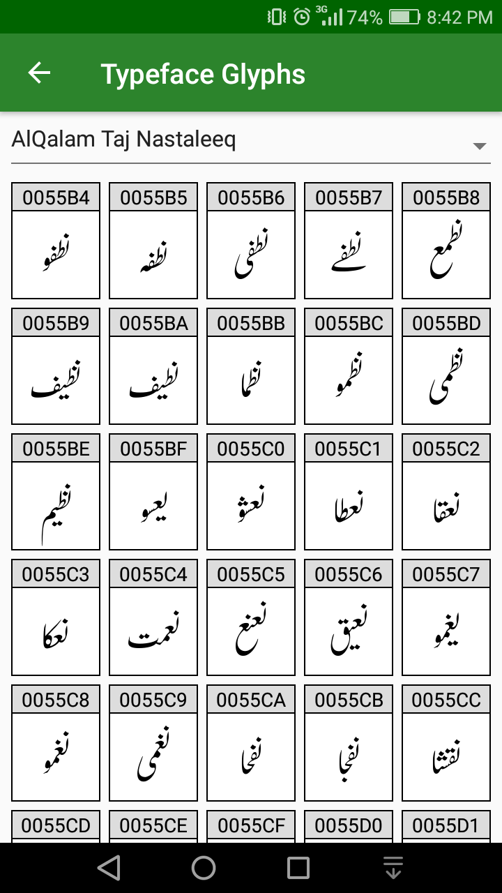
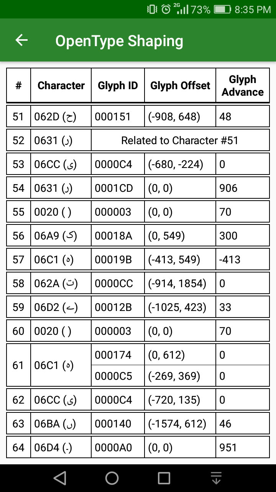
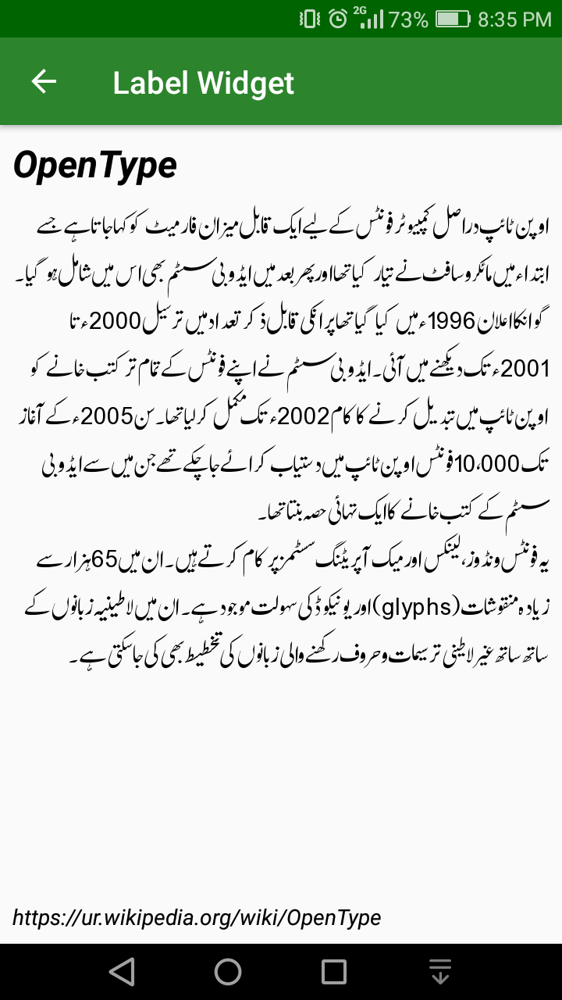

# Tehreer-Android
[](https://opensource.org/licenses/Apache-2.0)
[](http://search.maven.org/#search%7Cga%7C1%7Cg%3A%22com.github.mta452%22%20AND%20a%3A%22tehreer-android%22)

Tehreer is a library which gives full control over following text related technologies.

* Bidirectional Algorithm
* OpenType Shaping Engine
* Text Typesetting
* Text / Glyph Rendering

It is a wrapper over mature C libraries, [FreeType](https://www.freetype.org), [SheenBidi](https://github.com/mta452/SheenBidi) and [SheenFigure](https://github.com/mta452/SheenFigure). So a part of the library has been written in JNI in order to access the functionality of said libraries.

## Screenshots
  

## Installation
If you are building with Gradle, simply add the following line to the `dependencies` section of your `build.gradle` file:

```groovy
compile 'com.github.mta452:tehreer-android:2.3'
```

## Proguard
```
-keepclassmembers, includedescriptorclasses class * {
    native <methods>;
}
```

## API Reference
The [Javadocs](https://tehreer.github.io/Tehreer-Android/apidocs/) are available for online browsing. The Javadocs are also bundled as source Jars with each distribution for consumption in the IDE.

## License
```
Copyright (C) 2016-2018 Muhammad Tayyab Akram

Licensed under the Apache License, Version 2.0 (the "License");
you may not use this file except in compliance with the License.
You may obtain a copy of the License at

  http://www.apache.org/licenses/LICENSE-2.0

Unless required by applicable law or agreed to in writing, software
distributed under the License is distributed on an "AS IS" BASIS,
WITHOUT WARRANTIES OR CONDITIONS OF ANY KIND, either express or implied.
See the License for the specific language governing permissions and
limitations under the License.
```
